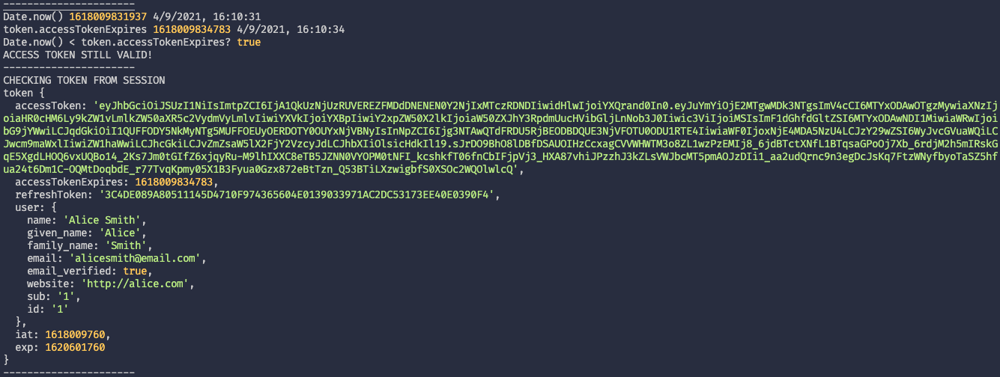
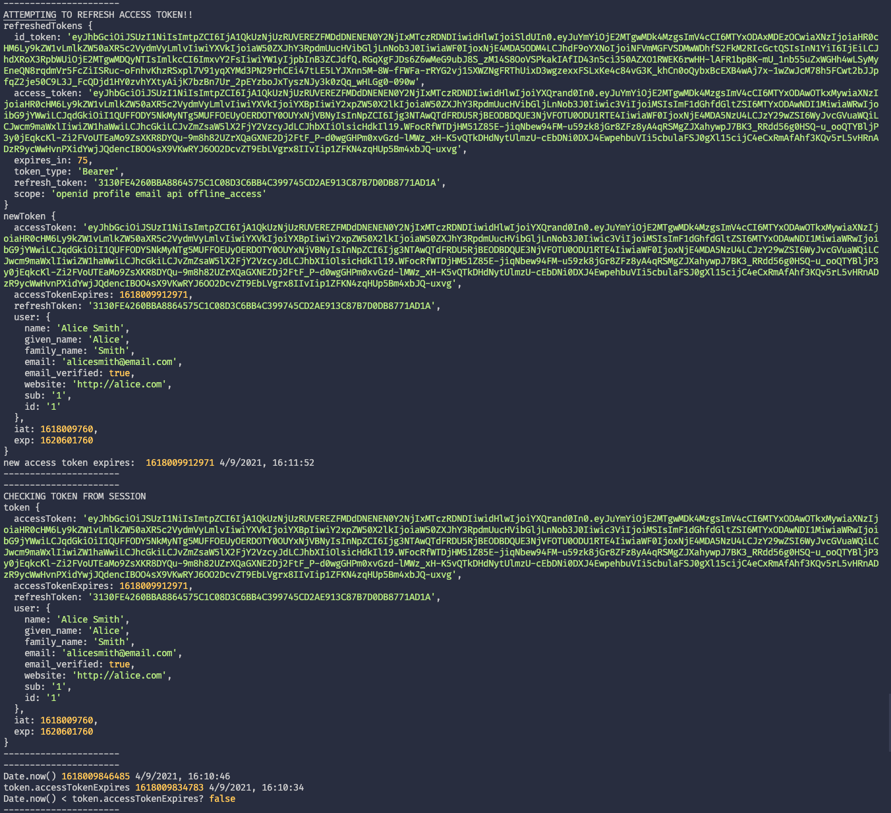
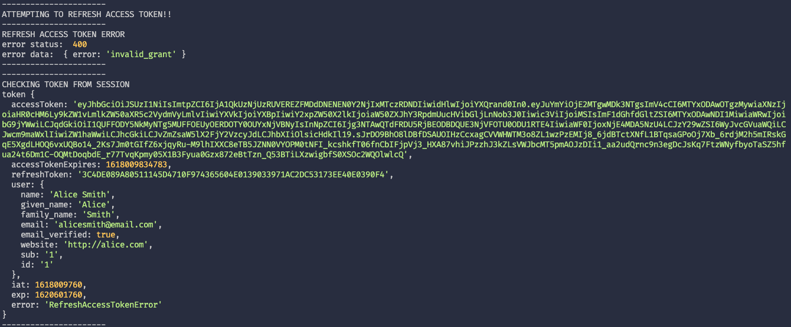

# next-auth-refresh-token

[Relevant Discussion](https://github.com/nextauthjs/next-auth/discussions/1455)

This repo is to reproduce the error in which rotating refresh tokens do not
seem to update the `accessTokenExpires` value correctly (IdentityServer4).

## Getting Started

Login to the demo IdentityServer with the following credentials:

```
username: alice
password: alice
```

## To Reproduce

1. Go to `server` route.
2. Open terminal to see server logs



3. The access token expires in 75 seconds, so click `server` route any point afterwards
to trigger a refresh token attempt.



**Pay attention to the `accessTokenExpires` value from the token retrieved - it
equals to the access token expires value we set from the `refreshAccessToken` function.**

4. If you now click `server` again, it will attempt to trigger a refresh token
retrieval again! You'll face an `invalid_grant` error.



**Notice `accessTokenExpires`? It's reverted back to the previous expire time**

